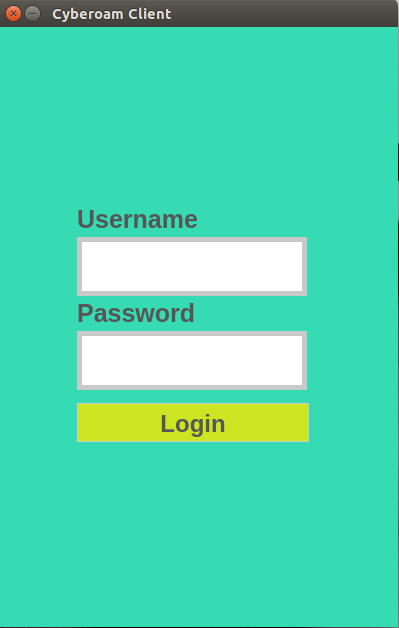
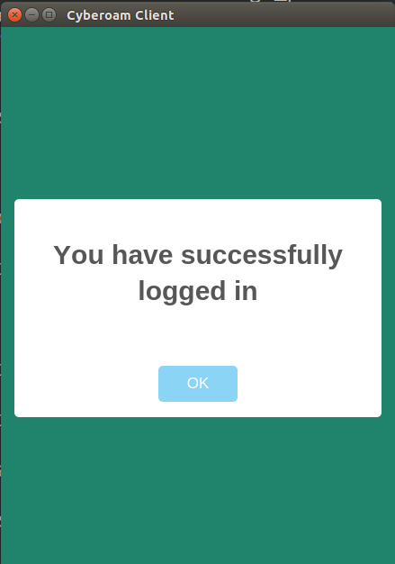
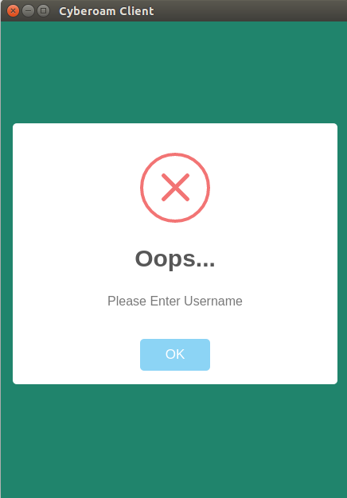

# &nbsp;Cyclient

> Unofficial Cyberoam client [WIP]

 

*Requires OS X 10.8+ or Linux. Windows support planned.*

## Dev

Built with [Electron](http://electron.atom.io).

## Usage

- Install dependencies: `$ npm install`
- Run: `$ npm start`
- Build OS X: `$ npm run build-osx`
- Build Linux: `WIP`

## License

MIT © [WebDevlabs](https://www.facebook.com/webdevlabs) 
